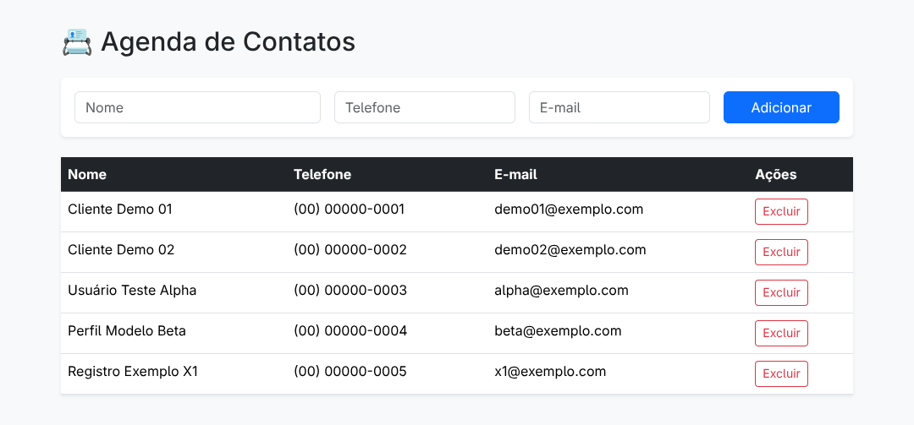

# Agenda de Contatos (MVC)

Aplicação de gestão de contatos construída com arquitetura MVC, focada em separação de responsabilidades e persistência local.

## Interface
A interface permite o gerenciamento direto de registros:
* **Formulário de Entrada:** Campos para Nome, Telefone e E-mail com botão de ação rápida para adicionar.
* **Tabela Dinâmica:** Listagem organizada com colunas para dados e ação de exclusão individual.

## Funcionalidades
* **Adicionar:** Inclusão de contatos através do formulário.
* **Listar:** Renderização automática da base de dados local.
* **Remover:** Exclusão individual de registros.
* **Persistência:** Sincronização automática com `localStorage`.

## Especificações Técnicas
* **Linguagem:** JavaScript (ES6+).
* **Arquitetura:** MVC (Model-View-Controller).
* **Módulos:** Suporte a ES6 Modules (`import`/`export`).
* **Armazenamento:** `localStorage`.
* **Entry Point:** `main.mjs`.

## Estrutura do Projeto
| Camada | Responsabilidade |
| :--- | :--- |
| **Model** | Lógica de dados, validação e persistência. |
| **View** | Manipulação do DOM e renderização da tabela/formulário. |
| **Controller** | Intermediação entre eventos do usuário, View e Model. |
